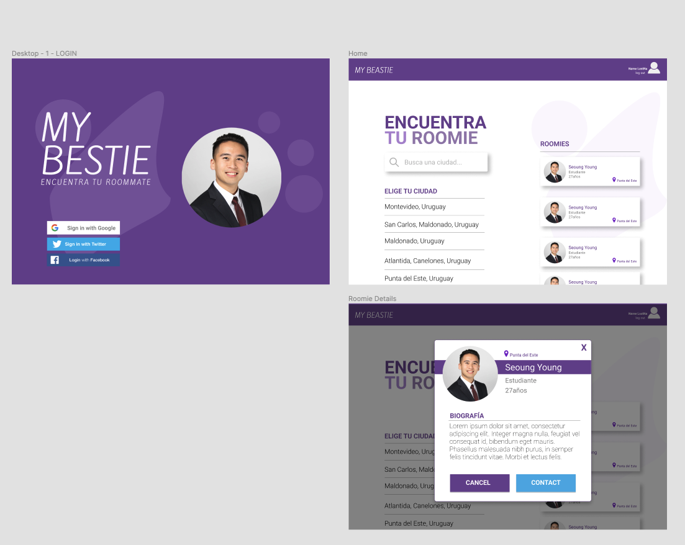

# Posible tecnologias

Web: React
Mobile: React Native? Flutter? PWA?
Backend: Node + Firebase? NestJS?

# Posibles aplicacion

Objetivo: MATCHEAR PERSONAS que vivir juntas

Pantallas:

Login:
Un login que se logue con las redes sociales o Email

Si no tiene cuenta:
Creacion de perfil: (La dejamos para maximizar la cantidad de gente que se crea cuenta)
(Lo que se pueda sacar de las redes sociales, se saca de ahi)
Nombre,
Apellido, Checkbox -> (Deseas mostrar publicamente tu apellido?
Edad,
Checkbox: Trabajas, Estudias, Ninguna
Si trabajas -> Ocupacion
Si estudia -> Donde?
Foto -> Se toma de las redes sociales | Puede elegir,

Pantalla principal:
Filtros: Ciudad | Barrios
Filtrar por presupuesto

Buscar compañero de apartamento: (Tipo mercadolibre)
Ficha con las publicaciones
Pantalla que contemple los dos casos de uso, del estilo:
"¿Que estas buscando?"
"Tengo apartamento y busco compañeros"
"Busco compañeros y apartamento"

Formulario para llenar los datos faltantes:

Busca compañero y apartamento:
Formulario de busqueda de compañero:

Presupuesto ->

- Una persona que tiene apartamento y quiere conseguir alguien que viva con ella
- Una persona que no tiene apartamento
  -> Puede elegir un apartamento
  -> Puede buscar otras personas para vivir (y luego elegir apartamento. Queda pa despues como lo elije)

Se cree una busqueda de lo que busca y muestre los que coinciden con esa busqueda

Tengo apartamento y busco compañero:

Perfil de la persona:
Redes sociales

Cuando hacen el match:

Feature:
Boton para compartir la informacion

Futuro:
Seccion de favoritos

Verificacion:
Foto de la cedula,
Apellido,
La insignia de verificado,

Categoria: Vivir fijo, Viaje, Temporal

Para viajar
Para vivir temporal
¿Que estas buscando?
Viajar con alguien...
Vivir temporalmente en un lugar...
Vivir durante una instancia larga
